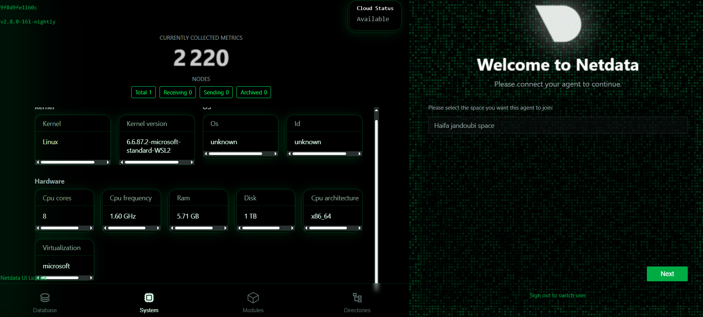
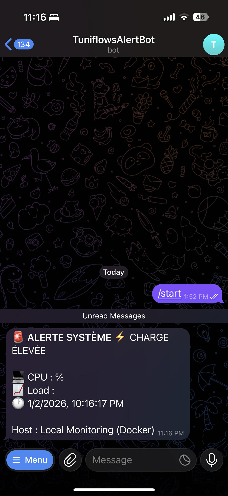

# System Monitoring & Intelligent Multi-Channel Alerting 🚨

**Projet personnel réalisé par Haifa – Ingénieure Automation & DevOps | Tunisie 🇹🇳**

Un système complet de **monitoring temps réel et alerting automatisé** déployé en environnement containerisé.  
Il surveille en continu les performances système (CPU, load, mémoire, réseau, containers Docker) et déclenche automatiquement des alertes intelligentes dès qu’un seuil critique est dépassé.

### 🎯 Objectif du projet
Détecter instantanément les problèmes de performance ou de surcharge, éviter les pannes et réagir rapidement – une solution idéale pour la supervision d’applications, de serveurs ou d’infrastructures cloud.

### 🛠 Stack technique
- **Docker & Docker Compose** – Déploiement reproductible et isolé
- **n8n (self-hosted)** – Orchestrateur d’automatisation (workflows cron-based, analyse conditionnelle)
- **Netdata** – Monitoring temps réel ultra-détaillé avec dashboard interactif
- **Prometheus Node Exporter** – Métriques standardisées
- **Telegram Bot API** – Alertes instantanées sur mobile
- **MariaDB** – Stockage historique des alertes avec politique de rétention

### ⚡ Fonctionnalités clés
- Collecte de métriques toutes les 5 minutes
- Analyse intelligente avec seuils configurables
- Alertes enrichies (timestamp, valeurs réelles, emoji)
- Envoi multi-canal : Telegram (implémenté), Slack & Email (extensible)
- Dashboard Netdata avec graphs animés (CPU par cœur, RAM, Docker, etc.)
- Historique persistant dans MariaDB

### 🚀 Lancement rapide
```bash
docker-compose up -d
```

Accès :
- **n8n** → http://localhost:5678 (admin / tuniflows2026)
- **Netdata** → http://localhost:19999
- **Prometheus Node Exporter** → http://localhost:9100/metrics

### 📸 Captures d’écran

  
*Workflow n8n : collecte Netdata → analyse → alerting*

  
*Dashboard Netdata – vue temps réel CPU, RAM, système*

  
*Docker Desktop – stack complet en exécution*

  
*Alerte reçue sur mobile via @TuniflowsAlertBot*

### 💡 Compétences développées
- DevOps & Infrastructure as Code
- Containerisation avancée (Docker)
- Orchestration d’automatisation (n8n)
- Observabilité & Real-time Monitoring
- Intégration API et event-driven architecture
- Gestion de bases de données et rétention
- Sécurité des credentials et bonnes pratiques

### 📂 Structure du repository
```
.
├── docker-compose.yml
├── workflow-monitoring.json
├── screenshots/
└── README.md
```

Projet réalisé avec passion pour démontrer une solution de monitoring professionnelle, scalable et prête pour la production.

Je suis à l’écoute de toute opportunité (stage, CDI, freelance) dans les domaines du **Cloud**, **Automation**, **DevOps**, **Testing**, **AI appliquée à l’infrastructure** ou **Observabilité**.  

N’hésitez pas à me contacter ! 🇹🇳✨

#DevOps #Monitoring #Automation #Docker #n8n #Netdata #Prometheus #OpenSource #WomenInTech #TunisieTech
```
